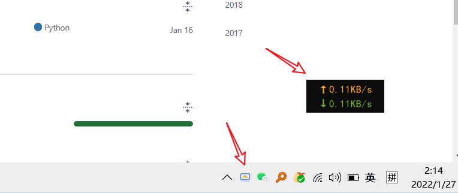

# net_io_count
在桌面动态显示实时网卡上传与下载流量

> **Motivation**: 一般的杀软类似360，火绒都会携带类似的小插件，非常美观易用，但是为了一个小插件专门去下载杀软没有必要，由此自己动手写一个并设为开机启动，非常方便。

## 1. 运行示例



## 1、终端运行
```shell script
pip install PyQt5 psutil
python run.py
```


## 2、客户端打包 
> 没有python环境的同学可以点击此处直接下载：[net_io_count](https://github.com/x-Long/net_io_count/releases/download/net_count_io/net_io_count.zip)
```shell script

pip install pyinstaller
pyinstaller -Dw run.py
# 打包方式兼容windows 与 linux
# 如果自己打包出来体积过大，建议直接使用上方下载链接的release版本（对体积进行过专门优化）
```

## 3、Windows设置开机自启
1. 进入上一步打包好的dist文件夹中找到run.exe, 并将logo.png 拖动至同一文件夹下
2. 对run.exe新建快捷方式
3. 将快捷方式拖动至```C:\ProgramData\Microsoft\Windows\Start Menu\Programs\StartUp```下即可


